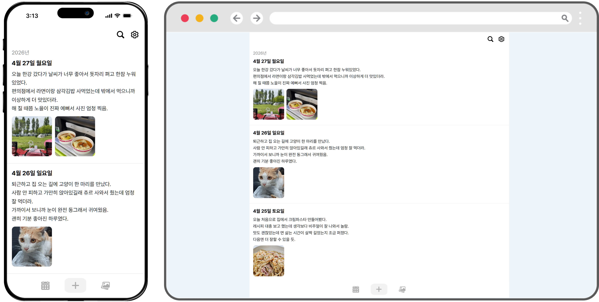

# Happy Memories

**웹과 모바일 앱(Android / iOS)을 모두 지원**하는 크로스 플랫폼 다이어리 서비스입니다.<br>
모든 플랫폼에서 동일한 데이터를 기반으로 동작하여, 모바일에서 작성한 일기를 웹에서 이어서 확인하고 수정할 수 있습니다.



---

## 기술 스택

### 프론트엔드
| 분류 | 기술 |
|---|---|
| UI 프레임워크 | React 19 + TypeScript |
| 빌드 도구 | Vite |
| 모바일 앱 | Capacitor 8 (Android / iOS) |
| 스타일 | SCSS Modules |

### 백엔드
| 분류 | 기술 |
|---|---|
| 언어 | Kotlin |
| 프레임워크 | Spring Boot 4 |
| ORM | Spring Data JPA |
| 인증 | JWT (HttpOnly Cookie) |
| 데이터베이스 | PostgreSQL 17 |

### 인프라 / DevOps
| 분류 | 기술 |
|---|---|
| 컨테이너 런타임 | Podman |
| 오케스트레이션 | Podman Compose |
| CI/CD | GitHub Actions |

---

## CI/CD 및 배포 구조

```
GitHub (main 브랜치)
    │
    ├── frontend/** 변경 시
    │       └── GitHub Actions: Docker 이미지 빌드 → ghcr.io 푸시 → 서버에 배포 (frontend 서비스만 재시작)
    │
    └── backend/** 변경 시
            └── GitHub Actions: Docker 이미지 빌드 → ghcr.io 푸시 → 서버에 배포 (backend 서비스만 재시작)

서버 (개인 PC) — Podman Compose
    ├── frontend   (Nginx + React 빌드 결과물)
    ├── backend    (Spring Boot JAR)
    ├── db         (PostgreSQL)
    └── cloudflared (Cloudflare Tunnel → https://bombi.cloud)
```

- `frontend/`와 `backend/`는 각각 독립 워크플로우로 관리되어, 변경된 서비스만 재배포됩니다.
- 배포 시 GitHub Secrets의 `ENV_FILE` 값이 서버의 `.env`로 주입됩니다.
- 이미지 업로드 파일은 `happy_memories_uploads` 볼륨으로 프론트엔드·백엔드 컨테이너 간 공유됩니다.

### GitHub Actions에 등록해야 하는 Secrets

| Secret 키 | 설명 |
|---|---|
| `ENV_FILE` | 서버 배포용 `.env` 파일 전체 내용 |
| `SERVER_IP` | 배포 서버 IP |
| `SERVER_SSH_PORT` | SSH 포트 |
| `SERVER_USER` | SSH 사용자명 |
| `SERVER_SSH_KEY` | SSH 개인키 |

---

## 시작 전 환경 설정

### 1. `.env` 파일 생성

프로젝트 루트에 `.env` 파일을 생성합니다.

```dotenv
# 로컬 개발용 DB 접속 정보
DB_HOST=localhost
DB_PORT=5432
DB_NAME=production
DB_USERNAME=postgres
DB_PASSWORD=secret

# JWT 서명 시크릿 (충분히 긴 문자열 권장)
JWT_SECRET_KEY=your_jwt_secret_key

# Cloudflare Tunnel 토큰 (배포 서버에서만 필요)
CLOUDFLARE_TUNNEL_TOKEN=your_cloudflare_tunnel_token

# 모바일 앱 prod 빌드 시 연결할 서비스 URL
SERVICE_URL=https://your-domain.com
```

### 2. 로컬 PostgreSQL 실행

로컬 개발 환경에서는 PostgreSQL이 별도로 실행되어 있어야 합니다.  
Docker를 사용하는 경우 아래 명령어로 빠르게 실행할 수 있습니다.

```bash
docker run -d \
  --name happy-memories-db-dev \
  -e POSTGRES_DB=production \
  -e POSTGRES_USER=postgres \
  -e POSTGRES_PASSWORD=secret \
  -p 5432:5432 \
  postgres:17-alpine
```

### 3. 프론트엔드 의존성 설치

```bash
cd frontend
npm install
```

---

## 개발 명령어

### 프론트엔드

```bash
cd frontend

# 웹 개발 서버 실행 (http://localhost:5173)
npm run dev
```

### 백엔드

```bash
cd backend

# 개발 서버 실행 (Spring Boot DevTools 포함, profile: dev)
./gradlew bootRun
```

---

## 모바일 앱 빌드

Capacitor를 사용하여 배포된 URL을 WebView로 표시하는 네이티브 앱을 빌드합니다.<br>
앱 내에 웹 화면을 번들링하지 않으며, 지정한 서버 URL에 네트워크로 접속합니다.

### 1. 개발 빌드 (로컬 개발 서버에 연결)

```bash
cd frontend

# 로컬 개발 서버(http://127.0.0.1:5173)에 연결하는 앱으로 동기화
npm run sync:dev
```

### 2. 프로덕션 빌드 (배포 서버에 연결)

```bash
cd frontend

# .env의 SERVICE_URL에 연결하는 앱으로 동기화
npm run sync:prod
```

### 3. Android 빌드

sync 완료 후 Android Studio에서 `frontend/android/` 프로젝트를 열어 빌드합니다.

```bash
# Android Studio가 설치되어 있다면 직접 열기
npx cap open android
```

### 4. iOS 빌드

sync 완료 후 Xcode에서 `frontend/ios/App/` 프로젝트를 열어 빌드합니다. (macOS 필요)

```bash
npx cap open ios
```

---

## 프로젝트 구조

```
happy_memories/
├── .env                    # 환경변수 (Git 제외)
├── frontend/               # React + Capacitor 프론트엔드
│   ├── src/                # 소스코드
│   ├── android/            # Android 네이티브 프로젝트
│   └── ios/                # iOS 네이티브 프로젝트
├── backend/                # Spring Boot 백엔드
│   └── src/main/kotlin/    # 소스코드
└── deploy/                 # 배포 관련 파일
    └── docker-compose.yml  # Podman Compose 설정
```
